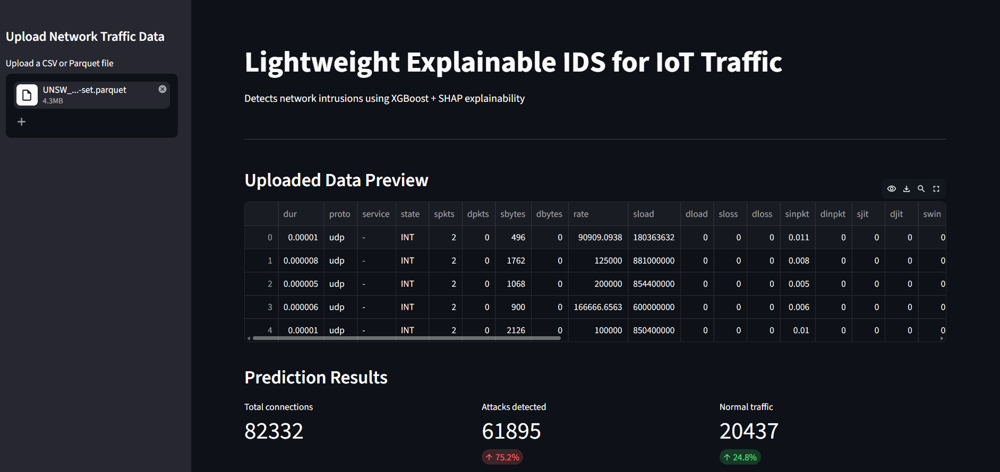
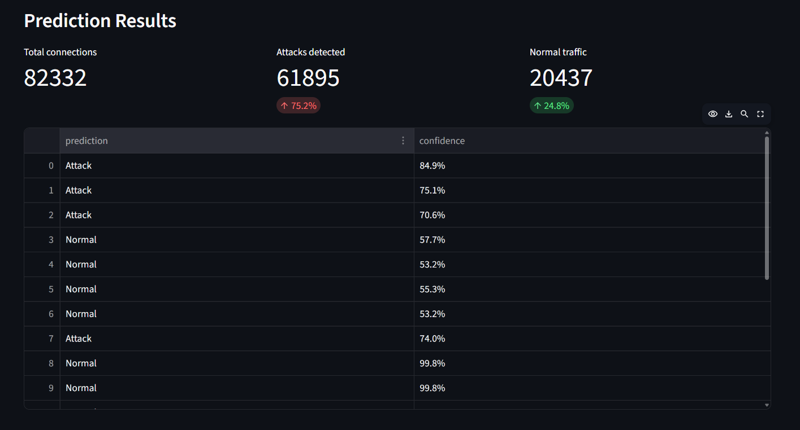
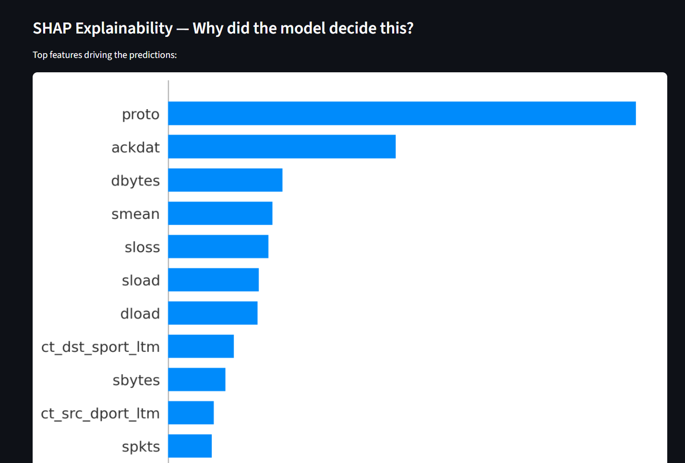

# Lightweight Explainable IDS for IoT Traffic

> Detects network intrusions in IoT environments using XGBoost + SHAP,
> with a live Streamlit dashboard for explainable predictions.

## Results
| Metric | Score |
|--------|-------|
| Accuracy | 90% |
| Attack Recall | 93% |
| Total Test Connections | 82,332 |
| Attacks Detected | 61,895 |

## Dashboard Screenshots

### Overview

### Predictions

### SHAP Explainability

## Dashboard
Upload any network traffic parquet/CSV file to get:
- Live attack vs normal classification
- Confidence score per connection
- SHAP explanation of top features driving each decision

## Top features identified by SHAP
1. proto — protocol type
2. ackdat — ACK data timing
3. dbytes — destination bytes
4. smean — mean source packet size
5. sload — source load

## Tech stack
Python · XGBoost · SHAP · Streamlit · scikit-learn · pandas

## How to run
    git clone https://github.com/Balajis111/iot-ids-xgboost
    cd iot-ids-xgboost
    pip install -r requirements.txt
    streamlit run app.py

## SOC Analyst relevance
- Binary classification mirrors Tier 1 SOC triage decisions
- SHAP outputs explain WHY each alert was raised
- Lightweight enough for IoT/edge deployment